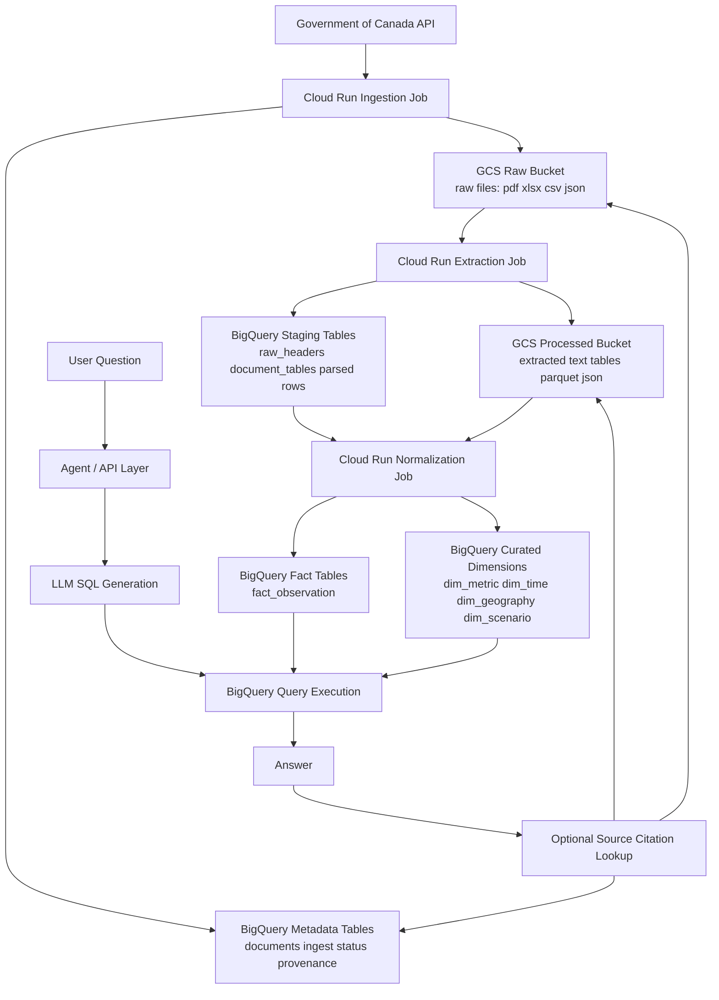

# CADagent: Government of Canada Data Platform

A data platform that ingests Government of Canada open data (Finance, StatCan, TBS-SCT), extracts tables from raw files, normalizes messy headers into canonical dimensions, and loads clean facts into BigQuery. An agent API layer answers natural-language questions with SQL and source provenance.

## Architecture



## Data Sources

| Department | Code | Data Types |
|-----------|------|------------|
| Finance Canada | `fin` | Federal budgets, fiscal monitors, economic forecasts, transfer tables |
| Statistics Canada | `statcan` | SDMX time series (labour, GDP, CPI, trade, demographics) |
| Treasury Board Secretariat | `tbs-sct` | Estimates, PSES surveys, proactive disclosure, COVID expenditures |

## Tech Stack

- **Language**: Python 3.12+
- **Orchestration**: Cloud Run jobs (one per pipeline stage)
- **Storage**: GCS (raw files + extracted artifacts)
- **Warehouse**: BigQuery (raw -> staging -> curated)
- **IaC**: Terraform
- **Agent**: FastAPI + Claude for NL-to-SQL

## Repository Structure

```
services/              # One sub-package per pipeline stage
  ingest/              # GoC API -> GCS + raw.documents
  extract/             # Raw files -> parsed tables, headers, cells
  normalize/           # Header classification + mapping -> curated dims/facts
  agent_api/           # NL question -> SQL -> answer + provenance
shared/                # Cross-service code
  config/              # Settings, logging
  clients/             # GCS, BigQuery, GoC API wrappers
  models/              # Document, table, observation dataclasses
  utils/               # Text normalization, time parsing, hashing
mappings/              # YAML dictionaries (metrics, geography, scenario, junk)
sql/                   # DDL + transform SQL by layer (raw/, staging/, curated/)
infra/                 # Cloud Run YAMLs + Terraform
scripts/               # One-off backfill / seed / reprocess helpers
docs/                  # Architecture and schema docs
external/              # Source data fixtures and schema inventories
```

## BigQuery Layers

| Layer | Tables | Purpose |
|-------|--------|---------|
| **raw** | `documents`, `extracted_tables`, `extracted_cells` | Source metadata and extraction artifacts |
| **stg** | `headers`, `header_mapping_candidates`, `row_values_long` | Parsed but not yet canonical staging data |
| **cur** | `dim_department`, `dim_document`, `dim_metric`, `dim_time`, `dim_geography`, `dim_scenario`, `dim_attribute_type`, `dim_attribute_value`, `fact_observation`, `bridge_observation_attribute` | Clean warehouse tables the agent queries |
| **quality** | `observation_quality` | Quality scores and review metadata |

## Pipeline Stages

1. **Ingest** -- Pull metadata + files from GoC CKAN API, dedup by `source_url` + checksum, land in GCS, write `raw.documents`
2. **Extract** -- Detect file type, route to parser (PDF/XLSX/CSV/HTML/XML), emit `raw.extracted_tables`, `stg.headers`, `stg.row_values_long`
3. **Normalize** -- Classify headers (metric/time/geo/scenario/attribute/junk), resolve mappings, pivot wide-to-long, load curated dims + `fact_observation`
4. **QA / Serve** -- Flag low-confidence mappings, expose provenance, support agent queries

## Setup

### Prerequisites

- Python 3.12+
- Google Cloud SDK (`gcloud`)
- Terraform
- A GCP project with BigQuery and Cloud Storage APIs enabled

### Local Development

```bash
# Clone and install
git clone <repo-url>
cd trace-ca
python -m venv .venv
source .venv/bin/activate
pip install -e ".[dev]"

# Copy and configure environment
cp .env.example .env
# Edit .env with your GCP project details

# Run DDL to create BigQuery tables
python scripts/seed_mappings.py

# Run ingestion for a department
python services/ingest/main.py
```

### Deploy Infrastructure

```bash
cd infra/terraform
terraform init
terraform plan
terraform apply
```

## Example Questions

The agent uses a tool-use loop and can introspect the warehouse before
answering — questions about *what's in the data* work just as well as
direct questions. The lists below reflect what's answerable given current
data coverage.

### Meta / discovery

- What data do you have?
- What can I ask about?
- Give me a summary of the data warehouse
- How much data do you have about Finance Canada?
- What metrics are available for StatCan?

### Finance tax expenditures

- What's the cost of the Charitable Donation Tax Credit?
- How much do Registered Pension Plans cost the treasury?
- What are the largest tax expenditures in Canada?
- What's the cost of the Scientific Research and Experimental Development Investment Tax Credit?
- Show me the Non-capital loss carry-overs over time
- Apprenticeship Job Creation Tax Credit cost
- Atlantic Investment Tax Credit
- Lifetime Capital Gains Exemption cost
- Logging Tax Credit amounts
- Refundable taxes on investment income of private corporations
- Tax treatment of farm savings accounts (AgriInvest and Agri-Québec)
- Registered Retirement Savings Plans tax cost
- Deductibility of charitable donations
- What tax expenditures relate to charity?
- List tax expenditures related to research

### StatCan census (2011 and 2016)

- What was the population in 2016?
- How did population change between 2011 and 2016?
- What are the largest population values in the data?
- Population of New Brunswick in 2016
- Population of Quebec
- Compare population in Newfoundland and British Columbia
- Population density data
- Housing dwellings in 2016
- Land area of Nunavut

### Named geographies (6 provinces have matched data)

- Data for New Brunswick
- Data for Nunavut
- Show me Quebec data
- British Columbia statistics
- Newfoundland and Labrador data
- Nova Scotia observations

### Time-based exploration

- What time periods does the data cover?
- Show me everything from 2016
- Recent Finance data since 2020

### Department-specific

- What's available from Finance Canada?
- Show me Treasury Board Secretariat data
- Department of Health data

### Stretch — multi-query (agent will explore)

- Which tax expenditure grew the most over time?
- Compare Finance and StatCan coverage
- Top 10 tax credits by total value
- Show me pension-related tax data
- List metrics with "credit" in the name

### Known gaps — will underperform

- GDP, inflation, unemployment, CPI — metric names aren't populated in
  `cur.dim_metric`
- Specific monthly or quarterly breakdowns — `cur.dim_time` currently only
  holds year labels
- Cross-departmental comparisons of specific dollar amounts — data shapes
  differ between departments
- Province-level Finance data — `geography_id` is mostly NULL for fin
- 2024 / 2025 projections — limited data past 2023

### Hero demos (recommended live order)

1. "What data do you have?" — shows the agent loop exploring
2. "What's the cost of the Charitable Donation Tax Credit?" — real Finance
   data with formatted markdown + citations
3. "What was the population in 2016?" — large numbers, good visual impact
4. "What are the largest tax expenditures?" — comparative, well-formatted
5. "Compare population between 2011 and 2016" — cross-time reasoning

## Design Docs

| Document | Path | Describes |
|----------|------|-----------|
| Repo layout | `docs/repo_schema/goc_repo_schema.md` | Target directory tree |
| Pipeline + mapping | `docs/pipeline_schema/goc_pipeline_and_mapping_plan.md` | Four pipeline stages, mapping philosophy |
| BigQuery schema | `docs/warehouse_schema/goc_bigquery_schema_summary.md` | Every table across all layers |
| CKAN API guide | `docs/external_api_guide/ckan-api-guide.md` | GoC open data API reference |
